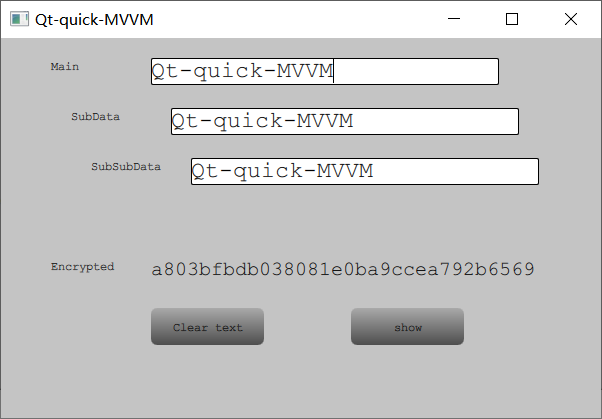

### Overview
This repo is inspired by [Antya Dev](https://bitbucket.org/AntyaDev/qtquickmvvmexample)  code for mvvm-quick/Qt framework demo.  

The kernel data structure used here is a nested hierarchical data, like **Main.SubData.SubSubData**  , aka the object tree, which demonstrate the viability of manipulating complex nested data structure using a single QMLView. No ViewModel is explicitly needed. 

Preview shown below:




### Simple Usage

Input any of Main, SubData, SubSubData TextBox would change all of the TextBoxes, and the Encrypted value TextBox would change with encrypted value accordingly. Clear Text would reset all the text boxes. 

### Implementations

1. return QObject* in each hierarchical model

   ```C++
   Q_PROPERTY(QObject* subModel READ subModel NOTIFY subModelChanged)
   QObject *subModel();
   ```

   to facilitate the object chain in QML bindings

   ```yaml
   Binding { target: mainModel.subModel; property: "subData"; value: subTbx.text }
   ```

   Note that the subModel could be directly used in Binding target;

2. Use bidirectional bindings in QML

   ```YAML
   TextBox {
           id: subTbx
           x: srcTbx.x + 20
           y: srcTxt.y + 50
           width: 348
           height: 27;
           Binding { // one-way binding
           	target: mainModel.subModel
           	property: "subData"
               value: subTbx.text 
           }
           Binding { // the-other-way binding
           	target: subTbx
               property: "text"
               value: mainModel.subModel.subData 
           }
       }
   ```

   Binding values of backend model and TextBox Control

3. Signals and Slots connections in Models

   ```C++
   // PROPERTY declaration
   Q_PROPERTY(QString subData READ subData WRITE setSubData NOTIFY subDataChanged)
   
   // catch the QML update timing, emit signal
   void MainSubModel::setSubData(const QString &data)
   {
       if (data != data_) {
           data_ = data;
           emit subDataChanged(data_);
       }
   }
   
   // connect slot
   connect(this,
           &MainSubModel::subDataChanged,
           this,
           &MainSubModel::slotSubDataChanged);
   
   // use slot to process
   void MainSubModel::slotSubDataChanged(QString arg)
   {
       // update parent model data
       this->mainModel_->setData(arg);
       // update child model data
       this->subSubModel_->setSubSubData(arg);
   }
   
   ```

   

### Test Environment

1. Windows 10 x64
2. Visual Studio 2017 x64
3. Qt 5.12.6 x64


### Acknowledgement

https://github.com/jaredtao 


